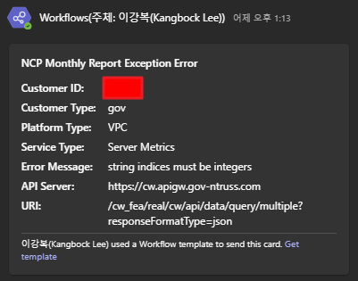

# MSP-NCP Monthly Report v2

## 개요
이 프로젝트는 Azure Key Vault에서 고객사 정보를 가져오고, NCP API를 호출하여 리소스 현황을 저장하도록 설계되었습니다. 리소스와 메트릭 데이터를 수집하여 JSON 파일로 휘발성 데이터를 저장하고, 모든 데이터를 데이터베이스에 저장하여 분석에 활용합니다.

## 요구 사항
- Python 3.x
- 필요한 Python 라이브러리 (`requirements.txt`에 명시됨)

**패키지 설치** <br>
```bash
pip install -r requirements.txt
```

**환경 변수 설정**
- `KEY_VAULT_NAME`: Azure 키 볼트 이름
- `DATABASE_SERVER`: 데이터베이스 서버 주소
- `DATABASE_NAME`: 데이터베이스 이름
- `DATABASE_USER`: 데이터베이스 사용자 이름
- `DATABASE_PWD`: 데이터베이스 비밀번호

## 실행 방법
1. Python 3가 설치되어 있는지 확인합니다.
2. 아래 명령어를 실행하여 프로세스를 시작합니다. <br>
```bash
python3 __main__.py
```
3. 실행 시 다음 작업이 수행됩니다.
- **환경 변수 로드**: `key_vault.py` 모듈을 사용하여 Azure 키 볼트에서 환경 변수를 로드합니다.  
- **API 매니저 초기화**: `api_manager.py` 모듈을 사용하여 API 매니저를 초기화합니다.
- **데이터 수집**:
    - `api/*.py` 모든 모듈을 사용하여 리소스 목록 또는 메트릭을 수집합니다.
    - 고객사별로 특정 리소스 또는 API 호출이 제외될 수 있습니다. 
        - 특정 리소스 제외 예: "CUSTOMER_ID": ["api.postgresql_list.PostgreSQL.postgresql_list"]
        - 특정 환경 제외 예: 특정 고객사는 Classic 리소스 제외
    - VPC와 Classic 환경에 따라 다른 API를 호출합니다.
- **JSON 파일 저장**: 수집된 데이터를 `json_util.py` 모듈을 사용하여 JSON 파일로 저장합니다.
- **데이터베이스 저장**: 수집된 데이터를 `db_util.py` 모듈을 사용하여 데이터베이스에 저장합니다.
- **예외 처리**:
    - API 호출 중 발생한 오류(`responseError` 또는 `error`)는 `try-exception` 블록을 통해 처리됩니다.
    - 발생한 예외는 로그로 기록되며, 웹훅을 통해 알림이 전송됩니다.
- **종료**: 모든 작업이 완료되면 프로그램을 종료합니다.

## 예외 처리
### API 호출 중 발생한 오류
- API 호출 시 `responseError` 또는 `error`가 포함된 응답이 반환될 경우, 예외가 발생합니다.
- 예외 메시지는 로그에 기록되며, 웹훅을 통해 알림이 전송됩니다.
- 예시:
    ```json
    {
        "responseError": {
            "returnCode": "802",
            "returnMessage": "You do not have authority about action : [NAS:View/getNASVolumeInstanceList]."
        }
    }
    ```
    처리 방식:
    - `returnMessage`를 추출하여 예외 메시지로 기록합니다.
    - 웹훅 알림에 포함된 예외 메시지:
        ```plaintext
        Error Message: You do not have authority about action : [NAS:View/getNASVolumeInstanceList].
        ```
        

### 고객사별 리소스 예외 처리
- 특정 고객사의 경우, 일부 리소스 호출이 제외됩니다.
- 예외 처리 로직은 `api_manager.py` 또는 각 리소스 모듈(`nas_list.py`, `server_image_list.py` 등)에 구현되어 있습니다.

### VPC/Classic 환경 예외 처리
- VPC와 Classic 환경에 따라 호출되는 API가 다릅니다.
    - VPC: `/vnas/v2/getNasVolumeInstanceList`
    - Classic: `/server/v2/getNasVolumeInstanceList`
- 환경에 따라 적절한 API를 호출하며, 데이터 구조가 다를 경우 이를 처리하는 로직이 포함되어 있습니다.

## 파일 설명
### `__init__.py`
- 패키지를 초기화하고 디렉토리 내 모듈이 올바르게 임포트될 수 있도록 설정합니다. 필요에 따라 패키지 수준 변수나 임포트를 포함할 수 있습니다.

### `__main__.py`
- 애플리케이션의 주요 진입점입니다. 고객사 정보를 가져오고, API와 상호작용하며, 결과를 저장하는 과정을 조율합니다.

### `api_manager.py`
- API 호출을 관리하는 주요 모듈입니다.
- 고객사별 리소스 제외 로직과 VPC/Classic 환경에 따른 API 호출 로직이 포함되어 있습니다.

### `db_util.py`
- 데이터베이스와 상호작용하는 모듈입니다.
- Pandas DataFrame 데이터를 데이터베이스에 저장하며, 저장 중 발생한 오류를 처리합니다.

### `json_util.py`
- JSON 파일을 생성하고 저장하는 모듈입니다.
- 수집된 데이터를 JSON 형식으로 저장하며, 파일 경로를 생성하고 저장 중 발생한 오류를 처리합니다.

### `key_vault.py`
- Azure Key Vault와 상호작용하는 모듈입니다.
- 환경 변수와 보안 정보를 Key Vault에서 가져옵니다.
- API 키 등 민감한 정보를 안전하게 관리합니다.

### `webhook_util.py`
- 웹훅을 통해 TEAMS에 알림을 전송하는 모듈입니다.
- API 호출 중 발생한 오류나 예외를 웹훅으로 전송하여 실시간으로 알림을 받을 수 있도록 합니다.

### `vm_start.sh`
- Azure VM을 자동으로 시작하고, 로그인 실패 시 Microsoft Teams로 알림을 전송하는 Bash 스크립트입니다.
- Azure Service Principal로 로그인 후, 지정된 VM을 시작합니다.
- 로그인 실패 등 오류 발생 시, Teams Webhook을 통해 관리자에게 즉시 알림 메시지를 전송합니다.
- CI/CD 파이프라인에서 VM 자동 기동 및 장애 감지에 활용됩니다.

### `weekly_report.py`
- 특정 고객사의 주간 리포트 생성을 위한 모듈입니다.
- 주간 단위로 리소스 및 메트릭 데이터를 수집합니다.

### `odbc.sh`
- 리눅스 환경에서 ODBC 드라이버(주로 Microsoft SQL Server용)를 설치 및 설정하는 Bash 스크립트입니다.
- 데이터베이스 연동을 위한 드라이버 설치, 환경 변수 설정, 테스트 연결 등을 자동화합니다.
- CI/CD 환경이나 신규 서버 세팅 시 데이터베이스 접근을 위한 필수 준비 작업에 사용됩니다.

---

## 자동화 (Azure Pipelines)
- 이 프로젝트는 Azure Pipelines를 사용하여 자동화됩니다.
- CI/CD 파이프라인을 통해 코드 변경 사항을 테스트하고 배포합니다.
- 주요 작업:
    - **월간보고서 v2**:
        - 지난달 모든 고객사 리소스 및 메트릭을 수집하는 파이프라인입니다.
    - **주간보고서**:
        - 특정 고객사의 주간보고를 위한 파이프라인입니다.
    - **월간보고서**:
        - 특정 고객사의 지난달 20일부터 이번달 20일까지의 리소스 및 메트릭을 수집하는 파이프라인입니다.
        - api_manager.py 파일에 주석 제거 금지
    - **월간보고서 VM 실행**:
        - 파이프라인 실행할 VM을 매월 말일 23:50분에 실행하는 파이프라인입니다.

---

## 추가 정보
- 프로젝트 구조는 모듈화되어 있어 유지보수와 확장이 용이합니다.
- 각 모듈은 특정 기능을 담당하며, 서로 독립적으로 동작합니다.
- 모든 민감 정보(키, 비밀번호 등)는 Azure Key Vault에서 안전하게 관리되며, 코드 내에 직접 노출되지 않습니다.
- Azure Pipelines와 같은 CI/CD 도구를 통해 정기적으로 리포트가 생성되고, 장애 발생 시 자동으로 알림이 전송되어 운영 효율성을 높입니다.
- 신규 고객사, 신규 리소스 타입, 신규 리포트 주기(월간/주간 등) 추가가 용이하도록 설계되어 있습니다.
- api 폴더 내 key 값은 NCP에서 발급받은 오픈 API Key만 사용하며, 실제 서비스용 민감 정보는 포함하지 않습니다.